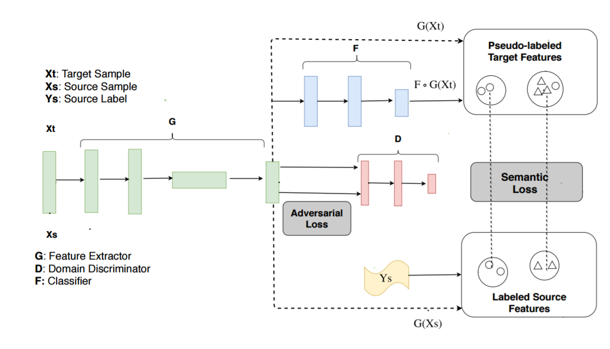
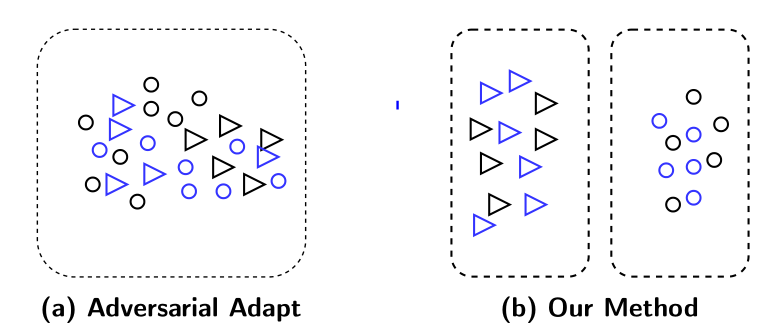

# Moving Semantic Transfer Network (ICML2018)


<div align="center">


</div>

Based on adversarial adaptation, we propose a `Pseudo Centroid Alignment Objective` to enforce `Semantic Transfer`. If you are limited to use a relative-small batch size (64 for 31-classification or 100 for 1000-classification), you might be interested in our `Moving Centroid Alignment`. 

###  Welcome to check our [paper](http://proceedings.mlr.press/v80/xie18c/xie18c.pdf).

## Citation
If you find this useful for your research, we would be appreciated if you cite the following papers:

```
@inproceedings{xie2018learning,
  title={Learning Semantic Representations for Unsupervised Domain Adaptation},
  author={Xie, Shaoan and Zheng, Zibin and Chen, Liang and Chen, Chuan},
  booktitle={International Conference on Machine Learning},
  pages={5419--5428},
  year={2018}
}
```

## Tips for your reproduction of DANN and our work MSTN.

My work is based on DANN. During my reimplementation of DANN, I noticed following problems worth attention for reproduing DANN and our work MSTN. Hope these could help you. :)

<li> Data Preprocessing </li>
<ol type="a">
<li> Scale image to 256x256. </li> 
<li >When training, source and target images would be "Random Cropping". When testing, target images would be "Center Cropping" (Caffe only uses crop command but the inner implemenattion actually random crop when training while center crop when testing). </li>
</ol>

<li> Implementing Moving Centroid </li>
<ol type="a">
<li>We can not just update the centroid by "moving_centroid=theta*moving_centroid+(1-theta)*current_centroid". This is just a update_op and need to be executed by specifying. (Look our code for more detail.)</li>
<li>Using tensorboard to check whether centroids have been updated.</li>
</ol>


## Contact
If you have any problem about this library, please create an Issue or send us an Email at:
- shaoanxie@outlook.com


## Acknowledgement for the code
For digits dataset, the code is modified from [Here](https://github.com/erictzeng/mldata). 
For real-world dataset, the code is based on [Here](https://github.com/dgurkaynak/tensorflow-cnn-finetune).
